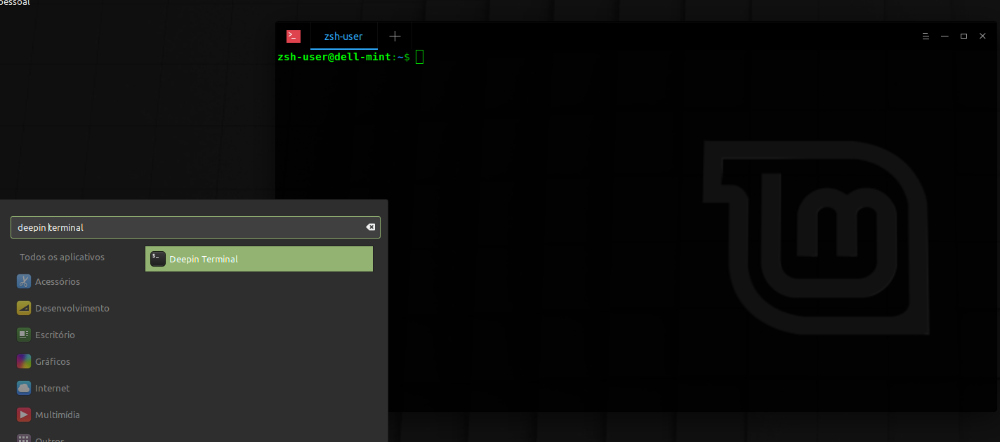
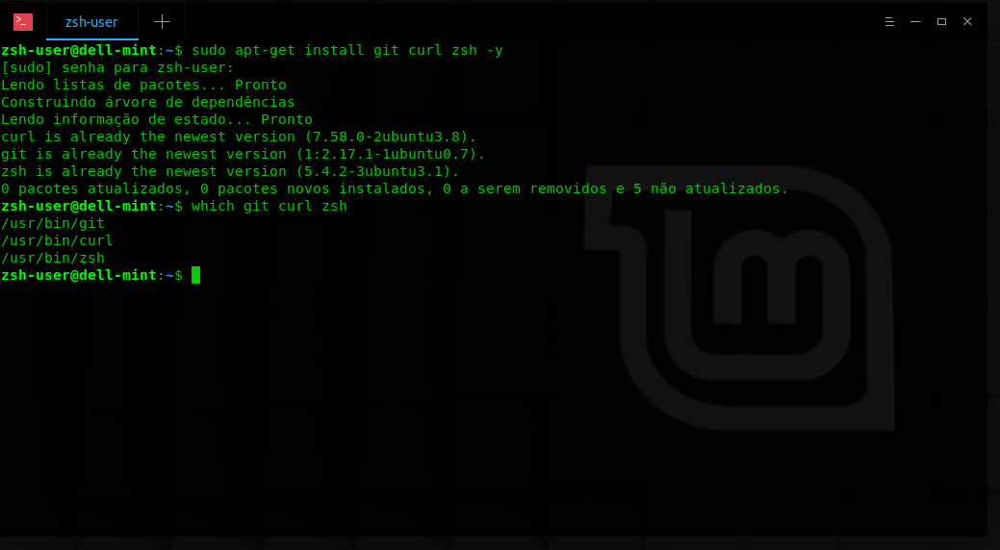
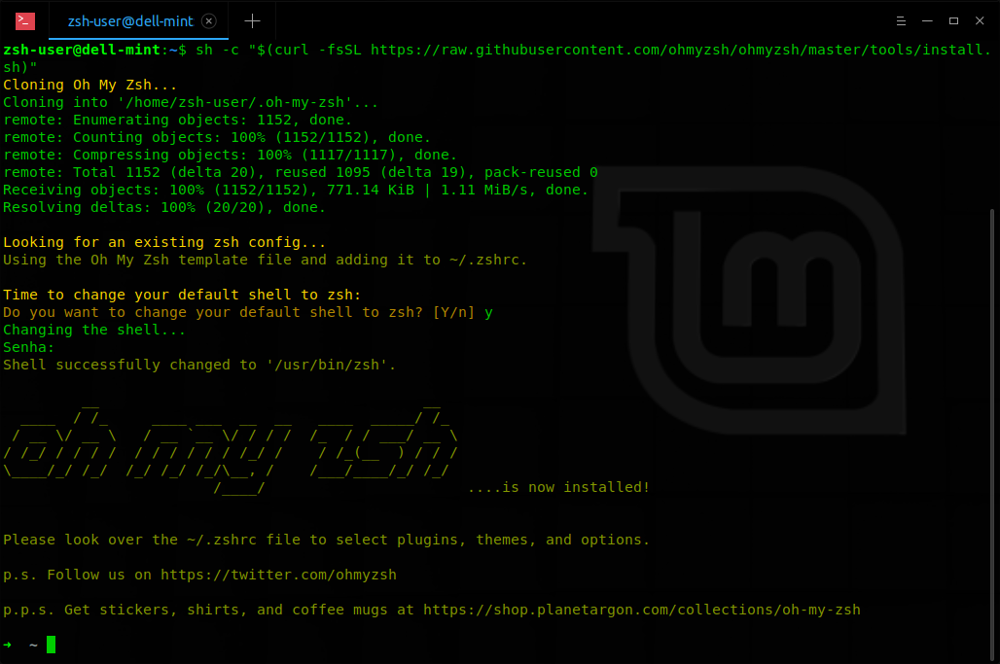
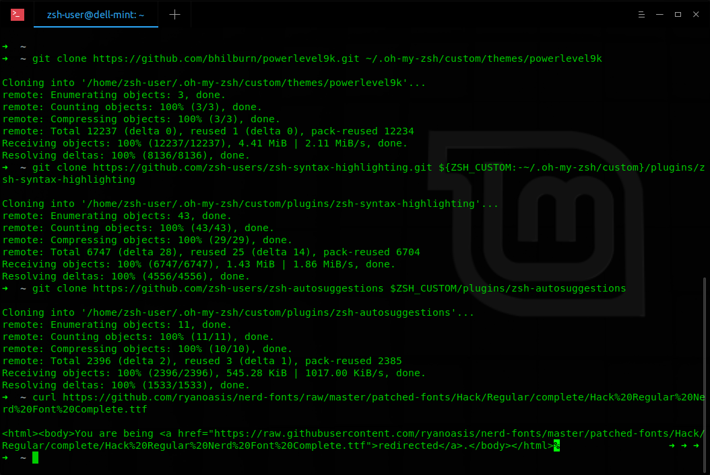
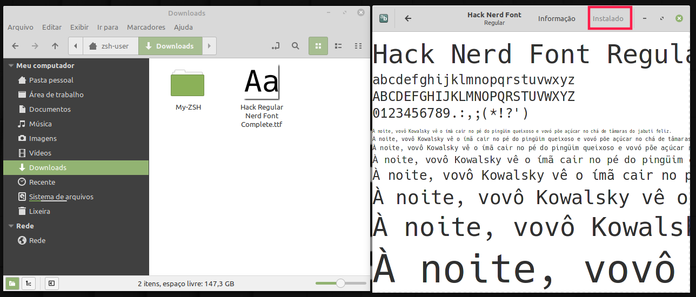
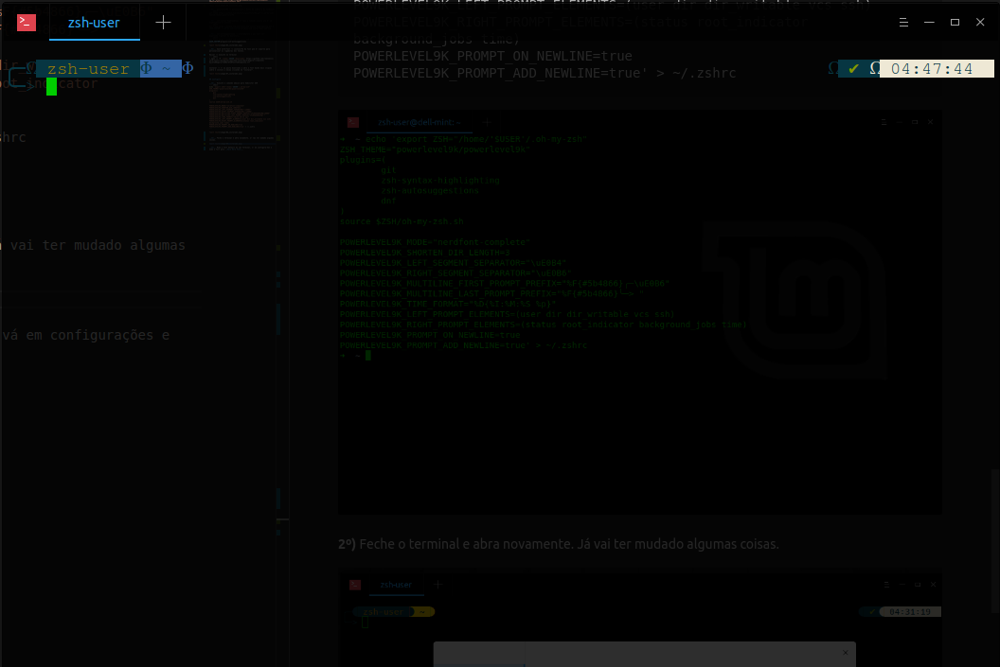
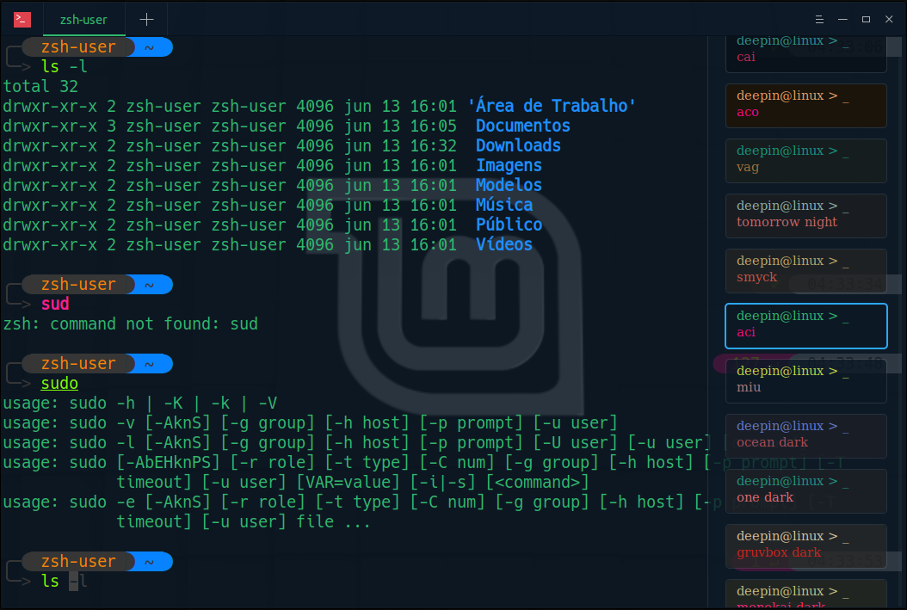
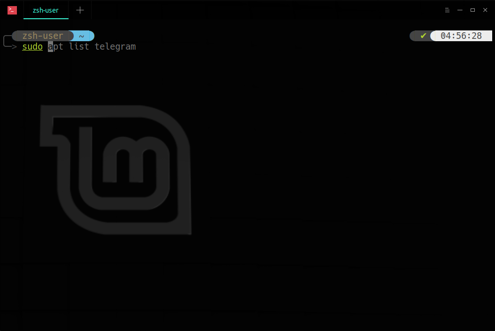
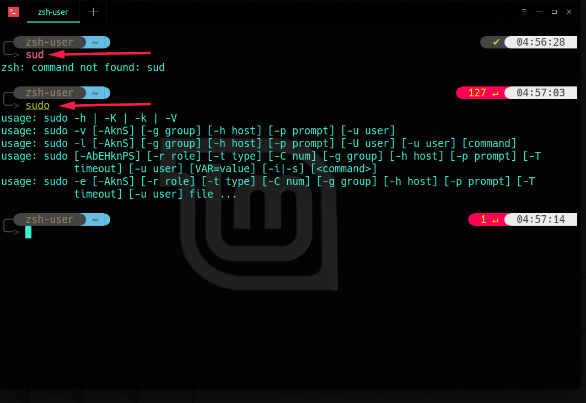
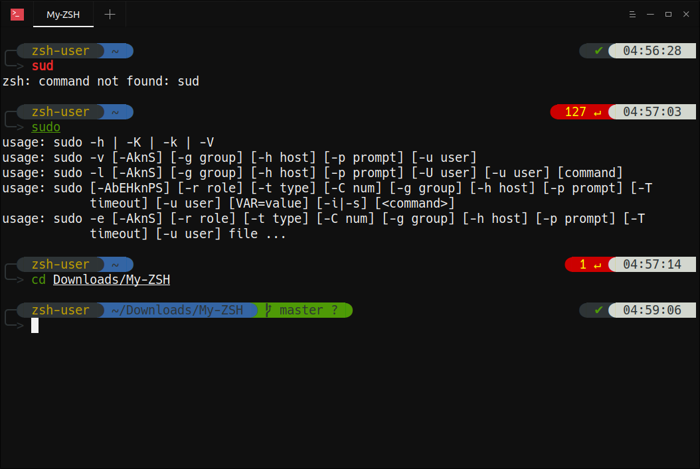

# My-ZSH
Essa é a minha configuração de terminal usando ZSH e mais alguma firulas.
Caso queira instale usando o arquivo Install ZSH-BUNITU.sh!

## Adendo e informações
Configuração para distro derivadas do Debian/Ubuntu.
Terminal que funciona 100%  -> deepin-terminal, instale usando o comando abaixo.
``` shell
sudo apt-get install deepin-terminal -y
```



Após instalar, abra o deepin-terminal e execute os comando abaixo!


## Instale o zsh e dependências

__1º)__ Instale as dependências
``` shell
sudo apt-get install git curl zsh -y
```

__2º)__ Verificar se foram instalados com sucesso.
``` shell
which git curl zsh
```



## Instale as firulas

__1º)__ .oh-my-zsh -> habilita e pré-configura o zsh.
``` shell
sh -c "$(curl -fsSL https://raw.githubusercontent.com/ohmyzsh/ohmyzsh/master/tools/install.sh)"
```


__2º)__ powerlevel9k -> personalizar a barra de endereço do terminal.
``` shell
git clone https://github.com/bhilburn/powerlevel9k.git ~/.oh-my-zsh/custom/themes/powerlevel9k
```

__3º)__ zsh-syntax-highlighting -> caso o comando exista, dará um highlight na palavra.
``` shell
git clone https://github.com/zsh-users/zsh-syntax-highlighting.git ${ZSH_CUSTOM:-~/.oh-my-zsh/custom}/plugins/zsh-syntax-highlighting 
```

__4º)__ zsh-autosuggestions -> autocompleta o que você está digitando à partir do histórico.
``` shell
git clone https://github.com/zsh-users/zsh-autosuggestions $ZSH_CUSTOM/plugins/zsh-autosuggestions
```


__4º)__ hack nerd-font -> instalação da font que dá suporte para personalizar as ligaduras dos textos.

Baixar -> execute no terminal 
``` shell
> wget -c -P '/home/'$USER'/Downloads' https://github.com/ryanoasis/nerd-fonts/raw/master/patched-fonts/Hack/Regular/complete/Hack%20Regular%20Nerd%20Font%20Complete.ttf
```

Instalar -> vá na pasta downloads e abra a font dando dois cliques sobre e instale a mesma clicando em "instalar".



Retorne para o terminal.


## Configure

__1º)__ Execute o comando abaixo para habilitar as configurações do ZSH.
``` shell
echo 'export ZSH="/home/'$USER'/.oh-my-zsh"
ZSH_THEME="powerlevel9k/powerlevel9k"
plugins=(
	git
	zsh-syntax-highlighting
	zsh-autosuggestions
	dnf
)
source $ZSH/oh-my-zsh.sh

POWERLEVEL9K_MODE="nerdfont-complete"
POWERLEVEL9K_SHORTEN_DIR_LENGTH=3
POWERLEVEL9K_LEFT_SEGMENT_SEPARATOR="\uE0B4"
POWERLEVEL9K_RIGHT_SEGMENT_SEPARATOR="\uE0B6"
POWERLEVEL9K_MULTILINE_FIRST_PROMPT_PREFIX="%F{#5b4866}╭─\uE0B6"
POWERLEVEL9K_MULTILINE_LAST_PROMPT_PREFIX="%F{#5b4866}╰─> "
POWERLEVEL9K_TIME_FORMAT="%D{%I:%M:%S %p}"
POWERLEVEL9K_LEFT_PROMPT_ELEMENTS=(user dir dir_writable vcs ssh)
POWERLEVEL9K_RIGHT_PROMPT_ELEMENTS=(status root_indicator background_jobs time)
POWERLEVEL9K_PROMPT_ON_NEWLINE=true
POWERLEVEL9K_PROMPT_ADD_NEWLINE=true
POWERLEVEL9K_PYTHON_ICON='' #'\UE73C'
POWERLEVEL9K_VIRTUALENV_BACKGROUND='red'
POWERLEVEL9K_VIRTUALENV_FOREGROUND='white'
POWERLEVEL9K_LEFT_PROMPT_ELEMENTS=(context dir vcs)
POWERLEVEL9K_RIGHT_PROMPT_ELEMENTS=(status root_indicator background_jobs virtualenv time)
' > ~/.zshrc
```


__2º)__ Feche o terminal e abra novamente. Já vai ter mudado algumas coisas.



__3º)__ Mude a font default do seu terminal, vá em configurações e mude a fort para __Hach Nerd Font__. 


__4º)__ Escolha o tema de sua preferência.




## Resultado final 

Auto complete/Auto sugestão



Highlighting caso exista, ficará verde, caso não vermelho.




Resultado final




## Bonus - Vscode

Para habilitar o terminal no vscode vá em __File > Preferences > Settings__!
Digite na busca "terminal font" mude o valor de "__Terminal > Integrated: Font Family__" para  'Hack Nerd Font' em seguida abra o arquivo de Settings.json clicando em "Edit in settings.json", adicione ou substitua pelos valores abaixo.
```json
	"terminal.integrated.shell.linux": "/usr/bin/zsh",
	"terminal.external.linuxExec": "deepin-terminal",
	"terminal.integrated.env.linux": {

	},
	"terminal.integrated.fontSize": 18,
	"terminal.integrated.env.windows": {

	}
```
